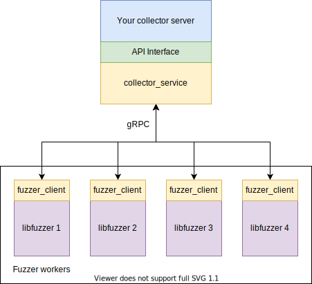
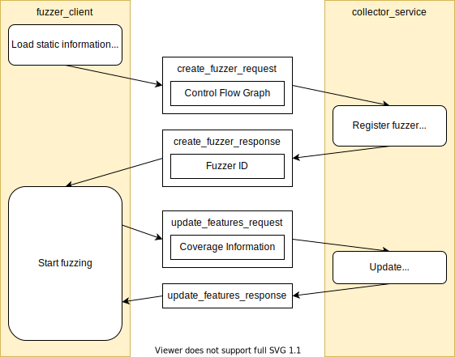

Fuzvisor
=======
A framework provides an interface to monitor and control fuzzers.

**DISCLAIMER:** This is not an officially supported Google product.

Fuzvisor is not a fuzzer but a controller of fuzzers. Its collecting server gathers the performance and coverage from multiple fuzzing workers through high-throughput gRPC protocol. And useful static program structures (e.g. control flow graph) are dumped during compile time and loaded by the collecting server for analysis during fuzzing. This framework makes it easier to build and experiment complex fuzzing control algorithm on top of the existing fuzzers (e.g. libfuzzer).

This project is still under heavy development.

Build
-----
**Prerequisites**

+ CMake >= 3.10
+ Toolchain to build Clang and LLVM
+ Latest Rust toolchain

**Build the modified Clang and LLVM**
```sh
mkdir fuzvisor-build && cd fuzvisor-build
cmake ../fuzvisor
cmake --build .
```

Usage
-----
**Prepare the fuzzing target**

Use the LLVM toolchain at `fuzvisor-build/third_party/llvm-prefix/src/llvm-build/bin/` to compile your target with `libfuzzer`. For example:
```sh
fuzvisor-build/third_party/llvm-prefix/src/llvm-build/bin/clang -fsanitize=fuzzer -O a.out target.cpp
```

**Start the example coverage collecting server**
```sh
cd fuzvisor/collector
cargo run --release --example coverage_collector
```

**Start the fuzzing target**

Same as running a `libfuzzer` target. For example:
```sh
./a.out -use_value_profile=1 -jobs=16
```

Then the collecting server will start showing the coverage information.

Demo
----
[](https://asciinema.org/a/kk92e269awcA6ZCTFB6Nmj1mR)

Branches
--------
This is a heavy-experiment-oriented project. There are some rapid changes on protocol and API in order to support new experiments. Those changes might not be well designed and hacky, therefore they are not directly merged back to the main branch. However, if you find some useful functions are missing, they might have been supported in the branches below.
| Branch                                                                               | Description           |
|--------------------------------------------------------------------------------------|-----------------------|
| [exp-priority-control](https://github.com/pzread/fuzvisor/tree/exp-priority-control) | Seed priority control |

Developer Guides (WIP)
---------------
**Component Overview**



**Execution Flow**


